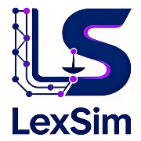

<div align="center">

</div>   
⚖ AI-Powered Legal Court Simulation Platform

## ⚡ Overview

**LexSim** is an AI-powered legal court simulation platform built on large language models and multi-agent collaboration. From uploading case materials to generating a verdict prediction report — fully AI-driven, faithfully reproducing real courtroom proceedings to serve legal research, law school education, and judicial practice training.

> You only need to: Upload case materials and describe your simulation requirements in natural language</br>
> LexSim will return: A complete courtroom simulation and a structured verdict prediction report

## ✨ Key Features

| Feature | Description |
|---------|-------------|
| **Dual Case Types** | Supports civil cases (contract disputes, torts, matrimonial property, etc.) and criminal cases (public prosecution, criminal-civil compound cases, etc.) |
| **Legal Ontology** | Automatically loads preset entity-type and relationship-type templates by case type for precise legal knowledge graph construction |
| **10+ Courtroom Roles** | AI agents for judge, plaintiff, defendant, plaintiff's attorney, defense attorney, prosecutor, witnesses, and more |
| **13 Hearing Rounds** | Complete simulation of opening statements, evidence examination, cross-examination, court debate, and final statements |
| **Real-Time Speech View** | Three-dimensional filtering by role, hearing phase, and agent; clear visualization of courtroom proceedings |
| **Verdict Prediction Report** | ReportAgent comprehensively analyzes the full hearing record and generates a structured verdict prediction report |
| **Verdict Dashboard** | Visualizes winning probability, statement weight distribution, evidence credibility analysis, and other key metrics |

## 🔄 Workflow

```
Create Case  →  Preparation  →  Courtroom Simulation  →  Verdict Generation
```

1. **Create Case**: Enter case name, select case type (civil / criminal), describe simulation requirements, upload case materials
2. **Preparation**:
   - Load legal ontology (entity and relationship type templates)
   - Build case knowledge graph (GraphRAG)
   - Generate courtroom personas (judge, attorneys, parties, etc.)
   - Configure simulation parameters and inject agents
3. **Courtroom Simulation**: Multi-agent parallel evolution with real-time speech logs and a hearing timeline
4. **Verdict Generation**: AI analyzes the full hearing and outputs a visual verdict prediction report

## 📸 Screenshots

<div align="center">


</div>

## 🚀 Quick Start

### Option 1: Source Code Deployment (Recommended)

#### Prerequisites

| Tool | Version | Description | Check Installation |
|------|---------|-------------|-------------------|
| **Node.js** | 18+ | Frontend runtime, includes npm | `node -v` |
| **Python** | ≥3.11, ≤3.12 | Backend runtime | `python --version` |
| **uv** | Latest | Python package manager | `uv --version` |

#### 1. Configure Environment Variables

```bash
cp .env.example .env
# Edit the .env file and fill in the required API keys
```

**Required Environment Variables:**

```env
# LLM API Configuration (supports any LLM API with OpenAI SDK format)
# Recommended: Alibaba Qwen-plus model via Bailian Platform: https://bailian.console.aliyun.com/
LLM_API_KEY=your_api_key
LLM_BASE_URL=https://dashscope.aliyuncs.com/compatible-mode/v1
LLM_MODEL_NAME=qwen-plus

# Zep Cloud Configuration (free monthly quota is sufficient): https://app.getzep.com/
ZEP_API_KEY=your_zep_api_key
```

#### 2. Install Dependencies

```bash
# One-click installation of all dependencies (root + frontend + backend)
npm run setup:all
```

#### 3. Start Services

```bash
npm run dev
```

**Service URLs:**
- Frontend: `http://localhost:3000`
- Backend API: `http://localhost:5001`

**Start Individually:**

```bash
npm run backend   # Start backend only
npm run frontend  # Start frontend only
```

### Option 2: Docker Deployment

```bash
cp .env.example .env
docker compose up -d
```

Maps ports `3000 (frontend) / 5001 (backend)` by default. Mirror addresses for faster image pulling are provided as comments in `docker-compose.yml`.

## 📄 Acknowledgments

LexSim's simulation engine is powered by **[OASIS (Open Agent Social Interaction Simulations)](https://github.com/camel-ai/oasis)**. We sincerely thank the CAMEL-AI team for their open-source contributions!
