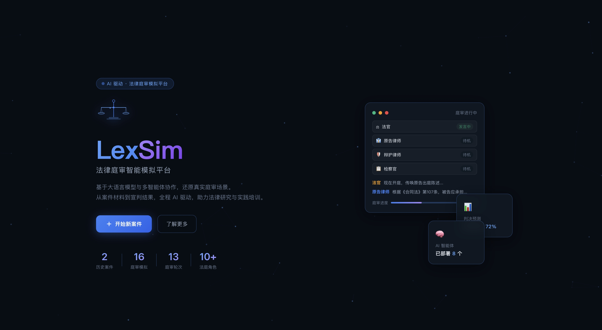
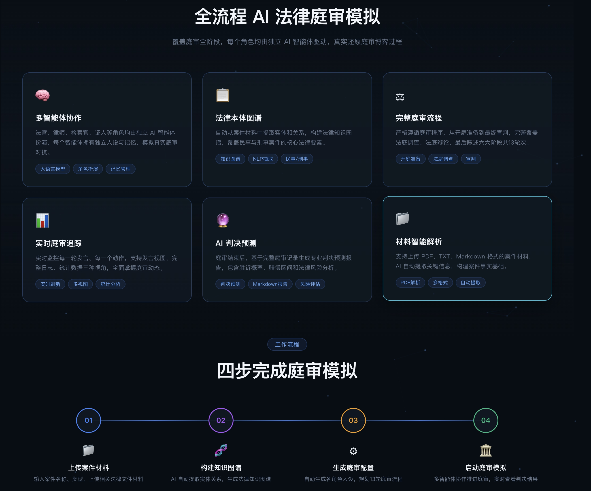
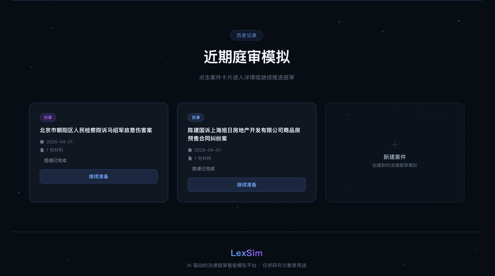
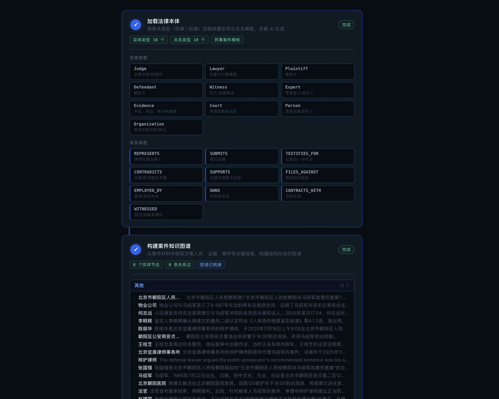
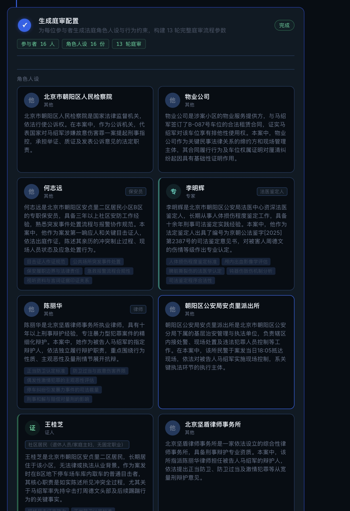
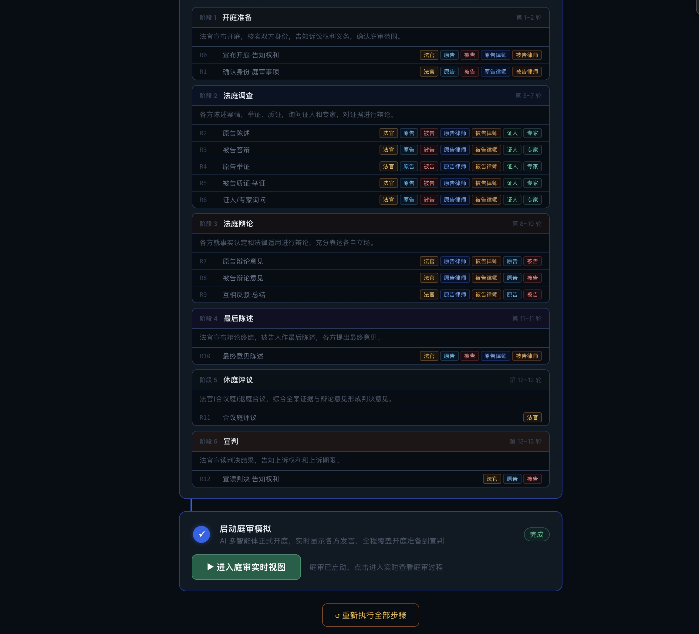
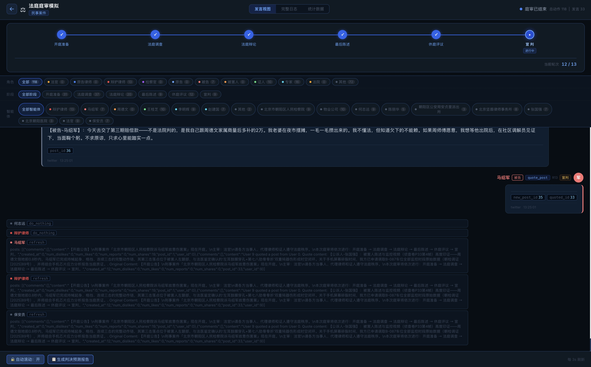
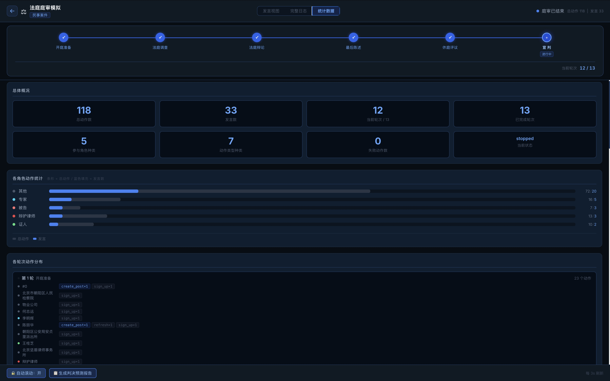
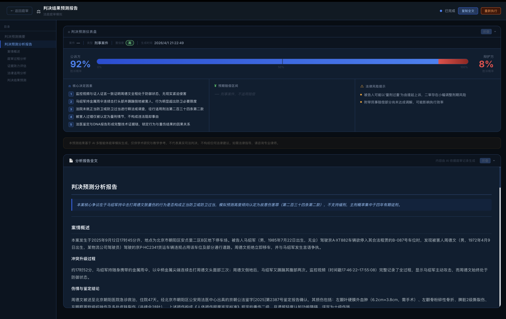

<div align="center">


⚖ AI 驱动 · 法律庭审模拟平台
</br>
<em>AI-Powered Legal Court Simulation Platform</em>

## ⚡ 项目概述

**LexSim** 是一款基于大语言模型与多智能体协作的法律庭审智能模拟平台。从案件材料上传到判决结果预测，全程 AI 驱动，还原真实庭审场景，助力法律研究、法学教育与司法实践培训。

> 你只需：上传案件材料，并用自然语言描述模拟需求</br>
> LexSim 将返回：完整的庭审模拟过程，以及一份结构化判决结果预测报告

## ✨ 核心特性

| 特性 | 说明 |
|------|------|
| **双类型案件** | 支持民事案件（合同纠纷、侵权、婚姻财产等）与刑事案件（公诉案件、刑事附带民事等） |
| **法律本体驱动** | 按案件类型自动加载预置实体类型与关系类型模板，精准构建法律知识图谱 |
| **10+ 法庭角色** | 法官、原告、被告、原告代理律师、被告辩护律师、检察官、证人等全角色 AI 智能体 |
| **13 轮庭审流程** | 完整还原开庭陈述、举证质证、法庭辩论、最后陈述等庭审阶段 |
| **实时发言视图** | 支持按角色、阶段、智能体三维筛选过滤，清晰呈现庭审进程 |
| **判决预测报告** | ReportAgent 综合分析全程庭审记录，生成结构化判决结果预测报告 |
| **判决仪表盘** | 可视化展示胜诉概率、各方陈述权重、证据采信分析等关键指标 |

## 🔄 工作流程

```
创建案件  →  准备阶段  →  庭审模拟  →  判决生成
```

1. **创建案件**：填写案件名称、选择案件类型（民事 / 刑事）、描述模拟需求、上传案件材料
2. **准备阶段**：
   - 加载法律本体（实体与关系类型模板）
   - 构建案件知识图谱（GraphRAG）
   - 生成庭审人设（法官、律师、当事人等）
   - 配置仿真参数并注入 Agent
3. **庭审模拟**：多智能体并行演化，实时呈现发言记录与庭审时间轴
4. **判决生成**：AI 综合分析庭审全程，输出可视化判决预测报告

## 📸 系统截图

<div align="center">











</div>

## 🚀 快速开始

### 一、源码部署（推荐）

#### 前置要求

| 工具 | 版本要求 | 说明 | 安装检查 |
|------|---------|------|---------|
| **Node.js** | 18+ | 前端运行环境，包含 npm | `node -v` |
| **Python** | ≥3.11, ≤3.12 | 后端运行环境 | `python --version` |
| **uv** | 最新版 | Python 包管理器 | `uv --version` |

#### 1. 配置环境变量

```bash
cp .env.example .env
# 编辑 .env 文件，填入必要的 API 密钥
```

**必需的环境变量：**

```env
# LLM API配置（支持 OpenAI SDK 格式的任意 LLM API）
# 推荐使用阿里百炼平台 qwen-plus 模型：https://bailian.console.aliyun.com/
LLM_API_KEY=your_api_key
LLM_BASE_URL=https://dashscope.aliyuncs.com/compatible-mode/v1
LLM_MODEL_NAME=qwen-plus

# Zep Cloud 配置（每月免费额度即可支撑简单使用）：https://app.getzep.com/
ZEP_API_KEY=your_zep_api_key
```

#### 2. 安装依赖

```bash
# 一键安装所有依赖（根目录 + 前端 + 后端）
npm run setup:all
```

#### 3. 启动服务

```bash
npm run dev
```

**服务地址：**
- 前端：`http://localhost:3000`
- 后端 API：`http://localhost:5001`

**单独启动：**

```bash
npm run backend   # 仅启动后端
npm run frontend  # 仅启动前端
```

### 二、Docker 部署

```bash
cp .env.example .env
docker compose up -d
```

默认映射端口 `3000（前端）/ 5001（后端）`，在 `docker-compose.yml` 中已通过注释提供加速镜像地址。


## 📄 致谢

LexSim 是由MiroFish项目启示。引擎由 **[OASIS](https://github.com/camel-ai/oasis)** 驱动，衷心感谢 CAMEL-AI 团队的开源贡献！
